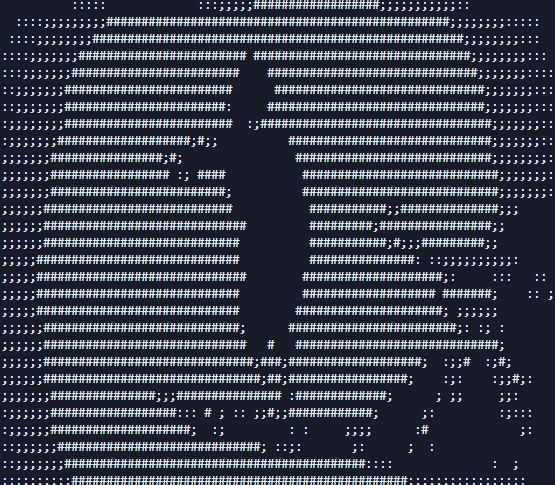

# ASCII Video Player

A Python-based terminal video player that converts videos to ASCII art and plays them directly in your terminal. This project transforms regular video files into text-based animations using ASCII characters, creating a unique retro-style viewing experience.

## Preview

Here are some screenshots of the ASCII Video Player in action:




## Features

- **Video to ASCII Conversion**: Converts video frames to ASCII art in real-time
- **Frame Interpolation**: Uses frame interpolation for smoother playback
- **Terminal Playback**: Displays ASCII video directly in your terminal
- **Cross-Platform Support**: Works on Windows, macOS, and Linux
- **Customizable Output**: Adjustable width and playback duration

## Requirements

- Python 3.6+
- OpenCV (opencv-python)
- Pillow (PIL)

## Installation

1. Clone this repository or download the source code:

```bash
git clone https://github.com/Romeo509/ascii-video-player.git
cd ascii-video-player
```

2. Install the required dependencies:

```bash
pip install -r requirements.txt
```

## Usage

Run the script with a video file as an argument:

```bash
python ascii_video_player.py [video_file]
```

If no video file is specified, it will default to `video.mp4` in the current directory.

### Examples

```bash
# Play the default video
python ascii_video_player.py

# Play a specific video
python ascii_video_player.py your_video.mp4
```

### Controls

- Press `Ctrl+C` to stop playback at any time

## How It Works

The ASCII Video Player works through several key steps:

1. **Video Loading**: Opens the video file using OpenCV
2. **Frame Processing**: Converts each frame to grayscale
3. **Resizing**: Resizes the frame to fit the terminal width while maintaining aspect ratio
4. **ASCII Conversion**: Maps pixel brightness values to ASCII characters
5. **Frame Interpolation**: Creates intermediate frames for smoother playback
6. **Terminal Display**: Clears the terminal and displays each ASCII frame

## Project Structure

```
ascii-video-player/
├── ascii_video_player.py  # Main script
├── requirements.txt       # Project dependencies
├── video.mp4              # Default video file
├── shot.png               # Preview screenshot 1
├── shot1.png              # Preview screenshot 2
└── ascii_frames/          # Directory for storing ASCII frames (if used)
```

## Technical Details

### ASCII Conversion

The conversion from image to ASCII uses a character set from light to dark:
```
"    :;;##"
```

Each pixel's brightness determines which character is used, creating a text representation of the image.

### Frame Interpolation

To achieve smoother playback, the player can generate intermediate frames between actual video frames. This is controlled by the `interpolation_factor` parameter, with higher values creating more intermediate frames.

## Limitations

- Terminal size affects the quality of the ASCII art
- Performance depends on your system's capabilities
- Very fast-moving scenes may appear blurry in ASCII

## License

[Add your license information here]

## Acknowledgments

- This project uses OpenCV for video processing
- Pillow (PIL) is used for image manipulation